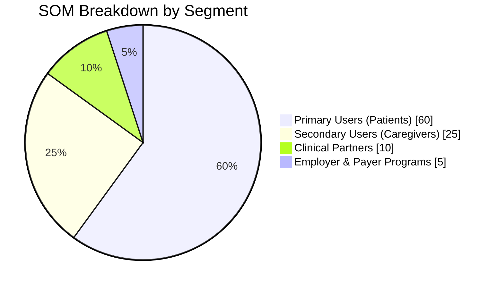

## NuviaCare Pitch Deck Blueprint

### 1. Cover
- **Title:** `NuviaCare — Intelligent Health Management`
- **Hook:** Empowering patients with proactive, personalized health insights.
- **CTA:** Seeking partners to scale preventive care.
- **Visual:** Diverse families using phones and tablets with a calming teal/indigo gradient backdrop.

### 2. Problem
- Fragmented personal health data across records, devices, and providers.
- Missed medications and appointments drive avoidable hospitalizations.
- Limited visibility for caregivers and clinicians between visits.
- **Visual:** Collage of pill bottles, appointment slips, and a concerned patient in muted red/orange tones.

### 3. Solution
- Unified digital companion delivering reminders, analytics, telehealth access, and device integration.
- Modules: vitals tracking, health-record uploads, AI health coach, caregiver collaboration, medication reminders.
- **Source:** [Health_management_app repository](https://github.com/Damian-Sonwa/Health_management_app.git).
- **Visual:** Product dashboard mockup with widgets, accented in vibrant teal/cyan.

### 4. Product Experience
- Flow: Sign-in → personalized dashboard → upload record → create reminder → sync device.
- Highlight PWA features: offline access, service worker caching, installable on any device.
- Showcase both desktop and mobile interactions.
- **Visual:** Split-screen showing the app on a laptop and phone with glowing UI elements.

### 5. Market Opportunity
- TAM: Global digital health + remote monitoring market estimated at **$390B** in 2025 (100% of available market).
- SAM: Chronic condition management and caregiver coordination segment at **$58B** (≈15% of TAM).
- SOM: Initial target—hypertension and diabetes patients served via partner clinics at **$5.8B** (≈10% of SAM / 1.5% of TAM).
- Year-3 revenue goal: **$32M**, representing ≈0.55% share of SOM.
- **Visual:** Minimalist bar/area charts overlaying a subtle world map silhouette.

### 6. Target Market
- **Primary Users (60% of SOM):** Adults aged 35–70 managing chronic cardiometabolic conditions (hypertension, type 2 diabetes) in North America and Europe who already track vitals or medications digitally at least once per week.
- **Secondary Users (25% of SOM):** Family caregivers and care coordinators responsible for medication adherence and appointment scheduling for aging parents or dependents.
- **Clinical Partners (10% of SOM):** Mid-sized telehealth practices and chronic care clinics seeking patient engagement tools and remote monitoring dashboards.
- **Employer & Payer Programs (5% of SOM):** Self-insured employers and health insurers running wellness programs focused on reducing readmissions and improving HEDIS adherence scores.
- Early adopter characteristics: tech-comfortable households with $60k–$150k income, high smartphone penetration, and existing interest in wellness apps.
- **Visual:** Persona cards highlighting “Chronic Patient,” “Caregiver,” and “Clinic Admin” profiles with key needs/pain points.



### 7. Business Model
- **B2C:** Freemium app with premium tiers (family sharing, AI coaching, PDF reports). 
- **B2B:** White-label for clinics, employer wellness integrations, analytics dashboards.
- Add-on revenue: telehealth sessions, data insights, device partnerships.
- **Unit Economics Targets:** Maintain gross margin above **65%** through digital delivery; target operating margin of **25%** by year 3 via scalable cloud infrastructure and automated onboarding.
- **Visual:** Stacked coins transitioning into digital tokens using teal/gold palette.

### 8. Traction & Roadmap
- Current: Working prototype (React/Vite frontend, Express backend), real-time sync, reminder engine, device integration foundations.
- 6–12 Month Roadmap:
  - Device partnerships (blood pressure & glucose monitors).
  - PDF report generation and email notifications.
  - Wearable integrations (Fitbit, Apple Watch, Garmin).
  - Predictive analytics and machine learning insights.
  - Subscription payments and family sharing features.
- **Visual:** Timeline infographic with milestone icons and soft gradients.

### 9. Technology & Security
- Stack: React + Vite, shadcn/ui, React Query, Recharts, Node/Express, MongoDB, JWT authentication.
- Security: HTTPS, JWT with 7-day expiry, role-based data isolation, Helmet.js, MongoDB Atlas.
- **Visual:** Futuristic shield overlay on circuit board lines.

### 10. Competitive Landscape
- Axes: Personalization vs. Integration Breadth.
- Competitors: Standalone medication reminders, pure analytics tools, telehealth-only platforms.
- Differentiators: Comprehensive suite, AI-driven recommendations, caregiver collaboration, PWA accessibility.
- **Visual:** Competitive matrix with NuviaCare highlighted in brand colors.

### 11. Go-To-Market Strategy
- Channels: Chronic care clinics, telehealth providers, employer wellness programs, targeted digital ads.
- Partnerships: Device manufacturers, insurance wellness initiatives, health coaches.
- Community: Online patient groups, caregiver networks, health influencers.
- **Visual:** Network diagram linking partner logos/icons.

### 12. Team
- Core roles: Product/Founder, Full-Stack Engineer, Healthcare Advisor, Data Scientist.
- Emphasize domain expertise and patient-centered design experience.
- **Visual:** Team portraits or silhouettes with mission statement overlay.

### 13. Financial Projections
- 3-year revenue outlook based on subscriber growth and B2B deals.
- Key metrics: CAC, LTV, churn assumptions, upsell potential for AI coaching.
- **Visual:** Gradient line charts and annotated KPI callouts.

### 14. Ask & Use of Funds
- Example ask: $1.5M seed round.
- Allocation: Product development 40%, device integrations 25%, sales/marketing 20%, compliance & security 15%.
- **Visual:** Pie chart with icons representing each allocation.

### 15. Closing / Call to Action
- Mission recap: Making proactive health management accessible for every household.
- Include QR code to live demo (Netlify deployment) and contact email.
- **Visual:** Happy family with wearable devices, CTA button overlay.

---

## Copy Library

### Value Propositions
- **One-liner:** “Your comprehensive health management platform for medication, vitals, and AI-guided coaching.”
- **Expanded:** “NuviaCare unifies health records, real-time vitals, caregiver collaboration, and smart reminders into a single, installable dashboard—helping patients stay ahead of chronic conditions.”
- **Patient-focused:** “Keep every reading, record, and reminder at your fingertips—wherever you go.”

### Problem Statements
- “75% of patients struggle to keep medication, appointment, and lab information organized.”
- “Missed reminders and fragmented health data lead to preventable hospitalizations and higher costs.”
- “Caregivers lack an easy way to monitor loved ones between clinical visits.”

### Social Proof (Placeholder)
- “I finally track everything I need in one app.” — Patient with hypertension.
- “Our clinic reduced missed follow-ups by 30% after rolling out NuviaCare.” — Partner provider.

### Metrics (Placeholder)
- “3× increase in medication adherence within 60 days.”
- “40% reduction in emergency appointments for participating patients.”
- “9/10 users report feeling more in control of their health.”

---

## Visual Design Guidelines
- **Palette:** Deep navy (#0D1B2A), teal (#14B8A6), coral accent (#EF4444), soft gray (#F1F5F9).
- **Typography:** Headers in Poppins bold; body copy in Lato regular.
- **Iconography:** Minimal line icons for vitals, calendar, pill, AI brain, caregiver.
- **Layout Tips:** 16:9 slides, max 3 bullets per slide, consistent card radius and drop shadow.
- **Motion:** Gentle hover animations and modal transitions for demo GIFs.
- **Backgrounds:** Gradient meshes with subtle medical motifs (heartbeat waves, molecules).

---

## Slide Assembly Checklist
1. Create deck in Google Slides or Keynote (16:9).
2. Apply consistent master slide with palette, fonts, and footer.
3. Insert QR code and short link to live demo on cover and closing slides.
4. Use screenshot placeholders for product demo slides; capture from latest build.
5. Add speaker notes emphasizing user stories, data points, and roadmap milestones.
6. Keep dense material (financial model, market sizing tables) in an appendix.

---

## AI Art Prompt
```
Create a high-resolution hero image for a digital health management startup pitch deck. Scene shows a diverse family interacting with a futuristic health dashboard on a tablet and smartwatch, surrounded by floating holographic health icons (heart rate, medication reminder, calendar). Color palette: deep navy, teal, and coral accents. Lighting should be soft and optimistic, conveying trust, innovation, and wellbeing. Style: clean, modern, slightly futuristic, with realistic lighting and gentle gradients.
```

*Use variations of the prompt for specific slides (e.g., clinician focus, device integration) to maintain a cohesive visual narrative.*

